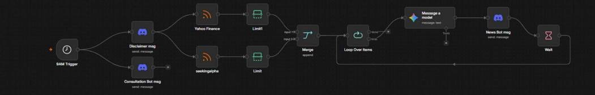
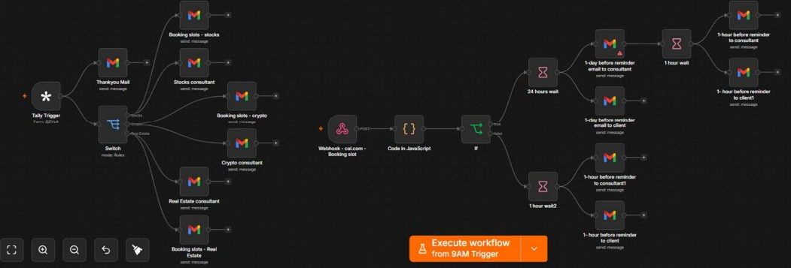

# AI Investment Consultation System

A fully automated investment community and consultation 
system built using N8N — no manual work required.

## What It Does

Every morning at 9AM two things happen simultaneously.

### For the Community
- Scans MarketWatch and SeekingAlpha for latest news
- Sends articles through Gemini AI for analysis
- Posts BUY / HOLD / AVOID recommendations to Discord
- Community gets fresh market insights every morning

### For Consultations
- Sends consultation form link to Discord
- Client fills name, email and area of interest
- Thank you email sent to client instantly
- Consultant notified with client details
- Client receives booking link with available slots only
- Google Meet link and calendar invite sent automatically
- Reminder emails 24 hours and 1 hour before meeting

## Tools Used

| Tool | Purpose |
|------|---------|
| N8N | Automation |
| Gemini AI | Market analysis |
| Discord | Community platform |
| Tally | Consultation form |
| Cal.com | Slot booking |
| Gmail | Emails |
| Google Calendar | Appointments |

## Workflow Overview

### Market Intelligence Workflow

### Consultation Workflow

## Who Is This For

- Investment communities
- Financial coaches
- Consultation based businesses
- Anyone who wants to automate client management

## Features

- Zero manual work
- Real time slot availability
- Automatic meeting links
- Smart reminder system
- AI powered market insights

## Future Improvements

- Payment integration before booking
- More news sources
- WhatsApp reminders
- Multi language support
